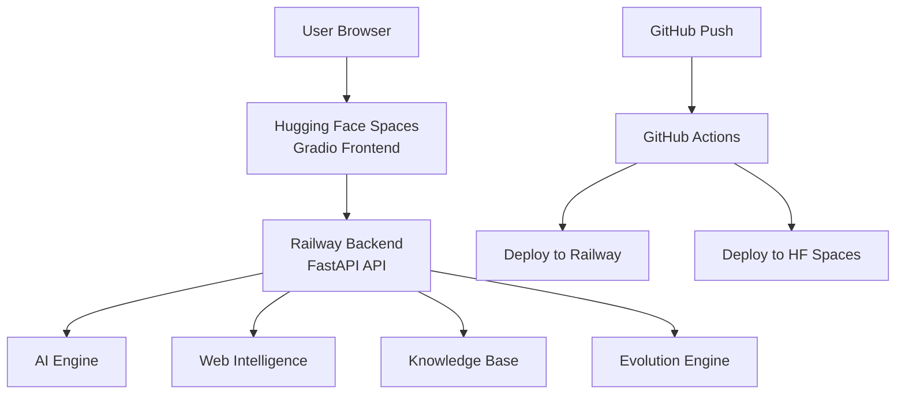

# 🧠 GlyphMind AI

**Local-First, Self-Evolving AI Assistant with Real-Time Learning**

GlyphMind AI is an advanced, modular AI assistant that combines local intelligence with web-connected learning capabilities. It features continuous background learning, real-time web search integration, and a comprehensive knowledge management system.

## ✨ Features

### 🤖 Core AI Capabilities
- **Multi-Model Support**: Flexible architecture supporting local models, OpenAI, Anthropic, and more
- **Expert-Level Performance**: Programming, mathematics, technical problem-solving
- **Intelligent Response Types**: Text, code generation, analysis, and structured outputs
- **Context-Aware Processing**: Maintains conversation context and learns from interactions

### 🌐 Web Intelligence
- **Real-Time Web Search**: Google Search, YouTube, Reddit integration
- **Automated Information Gathering**: Background learning from multiple sources
- **Content Aggregation**: Intelligent synthesis of web information
- **Source Attribution**: Transparent sourcing and citation

### 🧬 Evolution Engine
- **Continuous Learning**: Autonomous background knowledge acquisition
- **Adaptive Topics**: Learning priorities adjust based on user interests
- **Self-Improvement**: System performance optimization over time
- **Usage Pattern Recognition**: Personalized experience development

### 📚 Knowledge Management
- **Persistent Memory**: SQLite-based knowledge storage
- **Semantic Search**: Intelligent knowledge retrieval
- **Automatic Categorization**: Smart content organization
- **Version Control**: Knowledge update tracking

### 🚦 Advanced Architecture
- **Async Processing**: High-performance concurrent request handling
- **Request Routing**: Intelligent load balancing and prioritization
- **Rate Limiting**: API protection and resource management
- **Comprehensive Logging**: Full audit trail and performance monitoring

## 🏗️ Architecture

### Split Deployment Structure

```
glyphmind/
├── 📁 backend/           # Railway Backend Deployment
│   ├── 🧠 core/         # AI reasoning engine & model abstraction
│   ├── 🌐 web_intel/    # Web scraping & API integration
│   ├── 📚 knowledge_base/ # Persistent knowledge storage
│   ├── 🧬 evolution_engine/ # Background learning system
│   ├── 🚦 router/       # Request routing & load balancing
│   ├── 📊 ledger/       # Audit trails & transaction logs
│   ├── ⚙️  config/      # Configuration management
│   ├── 📝 logs/         # Comprehensive logging system
│   ├── 🎭 glyphs/       # Specialized AI personas
│   ├── 💾 cache/        # Request & response caching
│   ├── 📁 data/         # Raw & processed data storage
│   ├── 🖥️  server/      # FastAPI backend
│   ├── 📋 requirements.txt # Backend dependencies
│   ├── 🚀 Procfile      # Railway deployment config
│   ├── ⚙️  railway.json # Railway service config
│   └── 🏃 start.sh      # Startup script
│
├── 📁 frontend/         # Hugging Face Spaces Deployment
│   ├── 🎨 app.py       # Main Gradio UI (HF Spaces entry point)
│   ├── 📋 requirements.txt # Frontend dependencies
│   └── 🏃 run_local.py # Local development script
│
├── 📁 .github/workflows/ # CI/CD Pipeline
│   └── 🚀 deploy.yml   # Auto-deployment workflow
│
└── 📚 README.md        # Documentation
```

### Component Communication



## 🚀 Deployment Options

GlyphMind AI supports multiple deployment configurations:

### 🌐 **Production Deployment (Recommended)**

**Split deployment with automatic CI/CD:**
- **Backend**: Railway (FastAPI API)
- **Frontend**: Hugging Face Spaces (Gradio UI)
- **CI/CD**: GitHub Actions (auto-deploy on push)

#### Setup Steps:

1. **Clone the repository**
   ```bash
   git clone https://github.com/yourusername/glyphmind.git
   cd glyphmind
   ```

2. **Deploy Backend to Railway**
   - Create account at [Railway.app](https://railway.app)
   - Connect your GitHub repository
   - Deploy the `/backend` folder
   - Note your Railway backend URL

3. **Deploy Frontend to Hugging Face Spaces**
   - Create account at [Hugging Face](https://huggingface.co)
   - Create a new Space (Gradio SDK)
   - Set environment variable: `BACKEND_URL=https://your-backend.railway.app`
   - Upload the `/frontend` folder contents

4. **Setup GitHub Actions (Optional)**
   - Add repository secrets:
     - `RAILWAY_TOKEN`: Your Railway API token
     - `HF_TOKEN`: Your Hugging Face token
     - `HF_USERNAME`: Your HF username
     - `HF_SPACE_NAME`: Your HF space name
     - `BACKEND_URL`: Your Railway backend URL
   - Push to main branch triggers auto-deployment

### 🏠 **Local Development**

For local testing and development:

```bash
# Terminal 1: Start Backend
cd backend
python run_local.py

# Terminal 2: Start Frontend
cd frontend
python run_local.py
```

**Access Points:**
- **Frontend UI**: http://127.0.0.1:7860
- **Backend API**: http://127.0.0.1:8000
- **API Documentation**: http://127.0.0.1:8000/docs

## ⚙️ Configuration

### API Keys Setup

Edit `config/api_keys.json` to add your API keys:

```json
{
  "google_search_api_key": "your_google_api_key",
  "google_search_engine_id": "your_search_engine_id",
  "youtube_api_key": "your_youtube_api_key",
  "openai_api_key": "your_openai_api_key",
  "anthropic_api_key": "your_anthropic_api_key"
}
```

### System Settings

Modify `config/settings.json` for system configuration:

```json
{
  "server": {
    "host": "127.0.0.1",
    "port": 8000,
    "reload": true,
    "workers": 1,
    "log_level": "info"
  },
  "evolution": {
    "background_learning_enabled": true,
    "learning_interval_minutes": 30,
    "max_concurrent_searches": 5,
    "auto_update_knowledge": true
  }
}
```

### Getting API Keys

#### Google Search API
1. Visit [Google Cloud Console](https://console.cloud.google.com/)
2. Create a new project or select existing
3. Enable "Custom Search API"
4. Create credentials (API Key)
5. Set up [Custom Search Engine](https://cse.google.com/)

#### YouTube Data API
1. In Google Cloud Console, enable "YouTube Data API v3"
2. Use the same API key or create a new one

#### OpenAI API
1. Visit [OpenAI Platform](https://platform.openai.com/)
2. Create account and get API key from dashboard

## 🎯 Usage Examples

### Chat Interface
```python
# Direct API usage
import requests

response = requests.post("http://127.0.0.1:8000/chat", json={
    "text": "Explain quantum computing in simple terms",
    "user_id": "user123"
})

print(response.json()["reply"])
```

### Web Search
```python
# Search the web
response = requests.post("http://127.0.0.1:8000/search", json={
    "query": "latest AI breakthroughs 2024",
    "sources": ["google", "youtube"],
    "max_results": 10
})

results = response.json()["results"]
```

### Knowledge Base
```python
# Search knowledge base
response = requests.post("http://127.0.0.1:8000/knowledge", json={
    "query": "machine learning algorithms",
    "categories": ["technology", "science"],
    "max_results": 5
})

entries = response.json()["entries"]
```

## 🔧 Development

### Project Structure

- **Modular Design**: Each component is independently testable
- **Async Architecture**: Built for high concurrency
- **Type Hints**: Full Python typing support
- **Error Handling**: Comprehensive error management
- **Logging**: Detailed system monitoring

### Adding New Features

1. **New AI Models**: Implement `BaseAIModel` in `core/ai_engine.py`
2. **Web Sources**: Extend `BaseWebSource` in `web_intel/web_intelligence.py`
3. **API Endpoints**: Add routes in `server/app.py`
4. **UI Components**: Enhance `ui/ui.py` with new Gradio components

### Testing

```bash
# Run tests (when implemented)
pytest tests/

# Type checking
mypy glyphmind/

# Code formatting
black glyphmind/
```

## 📊 Monitoring & Analytics

### System Status
- Real-time component health monitoring
- Performance metrics and statistics
- Resource usage tracking
- Error rate monitoring

### Audit Trail
- Complete transaction logging
- User interaction tracking
- API call monitoring
- Cost tracking for external services

### Knowledge Growth
- Learning session statistics
- Knowledge base growth metrics
- Topic interest analysis
- Source reliability tracking

## 🛡️ Security & Privacy

### Local-First Design
- All processing happens locally by default
- Web searches are optional and user-controlled
- No data sent to external services without consent

### Data Protection
- SQLite databases for local storage
- No cloud dependencies required
- User data remains on local machine
- Transparent data handling

### API Security
- Request rate limiting
- Input validation and sanitization
- Error handling without data leakage
- Optional authentication integration

## 🚀 Performance

### Optimization Features
- **Async Processing**: Non-blocking request handling
- **Intelligent Caching**: Reduced redundant processing
- **Request Routing**: Load balancing and prioritization
- **Background Learning**: Non-intrusive knowledge acquisition

### Scalability
- Horizontal scaling support
- Database connection pooling
- Memory-efficient processing
- Configurable resource limits

## 🤝 Contributing

We welcome contributions! Here's how to get started:

1. **Fork the repository**
2. **Create a feature branch**: `git checkout -b feature/amazing-feature`
3. **Make your changes** with proper documentation
4. **Add tests** for new functionality
5. **Submit a pull request**

### Development Guidelines
- Follow PEP 8 style guidelines
- Add type hints to all functions
- Include docstrings for modules and functions
- Write tests for new features
- Update documentation as needed

## 📚 Documentation

### API Documentation
- **Interactive Docs**: http://127.0.0.1:8000/docs
- **OpenAPI Spec**: http://127.0.0.1:8000/openapi.json

### Code Documentation
- Comprehensive docstrings throughout codebase
- Type hints for all functions and classes
- Inline comments for complex logic
- Architecture decision records (ADRs)

## 🐛 Troubleshooting

### Common Issues

#### Backend Won't Start
```bash
# Check Python version
python --version  # Should be 3.10+

# Install missing dependencies
pip install -r requirements.txt

# Check port availability
netstat -an | findstr :8000
```

#### Frontend Connection Errors
- Ensure backend is running on port 8000
- Check firewall settings
- Verify network connectivity

#### API Key Issues
- Verify API keys in `config/api_keys.json`
- Check API quotas and billing
- Ensure APIs are enabled in respective consoles

### Debug Mode

Enable debug logging in `config/settings.json`:
```json
{
  "server": {
    "log_level": "debug",
    "reload": true
  }
}
```

## 📄 License

This project is licensed under the MIT License - see the [LICENSE](LICENSE) file for details.

## 🙏 Acknowledgments

- **FastAPI**: High-performance web framework
- **Gradio**: Beautiful ML interfaces
- **Pydantic**: Data validation and settings
- **aiohttp**: Async HTTP client/server
- **SQLite**: Embedded database engine

## 🔮 Roadmap

### Near Term (v1.1)
- [ ] Enhanced AI model integration (Ollama, Hugging Face)
- [ ] Voice interaction support
- [ ] Mobile-responsive UI
- [ ] Docker containerization

### Medium Term (v1.5)
- [ ] Multi-user support with authentication
- [ ] Plugin system for extensibility
- [ ] Advanced analytics dashboard
- [ ] Integration with more data sources

### Long Term (v2.0)
- [ ] Distributed deployment support
- [ ] Advanced reasoning capabilities
- [ ] Custom model training
- [ ] Enterprise features

---

## 💬 Support

- **Issues**: [GitHub Issues](https://github.com/yourusername/glyphmind/issues)
- **Discussions**: [GitHub Discussions](https://github.com/yourusername/glyphmind/discussions)
- **Documentation**: [Wiki](https://github.com/yourusername/glyphmind/wiki)

**Made with ❤️ by the GlyphMind team**